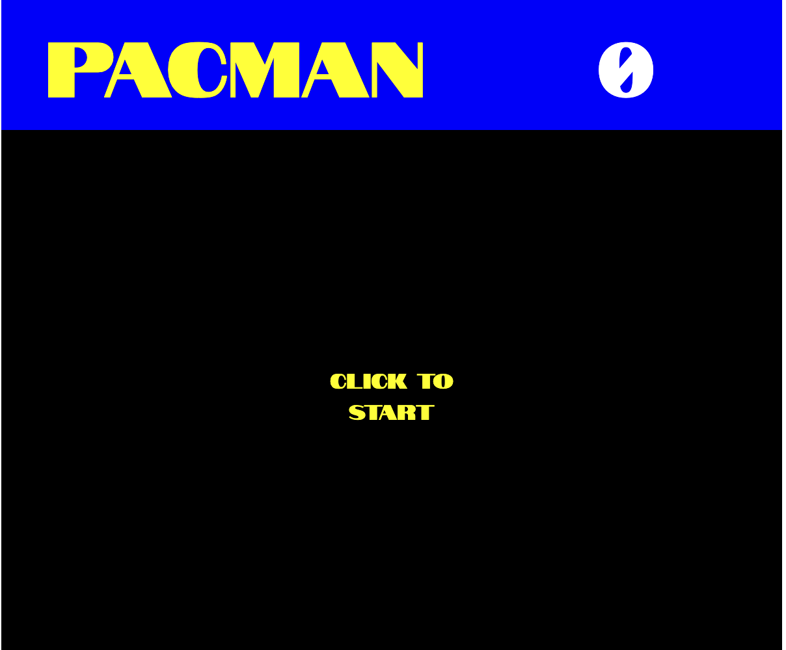
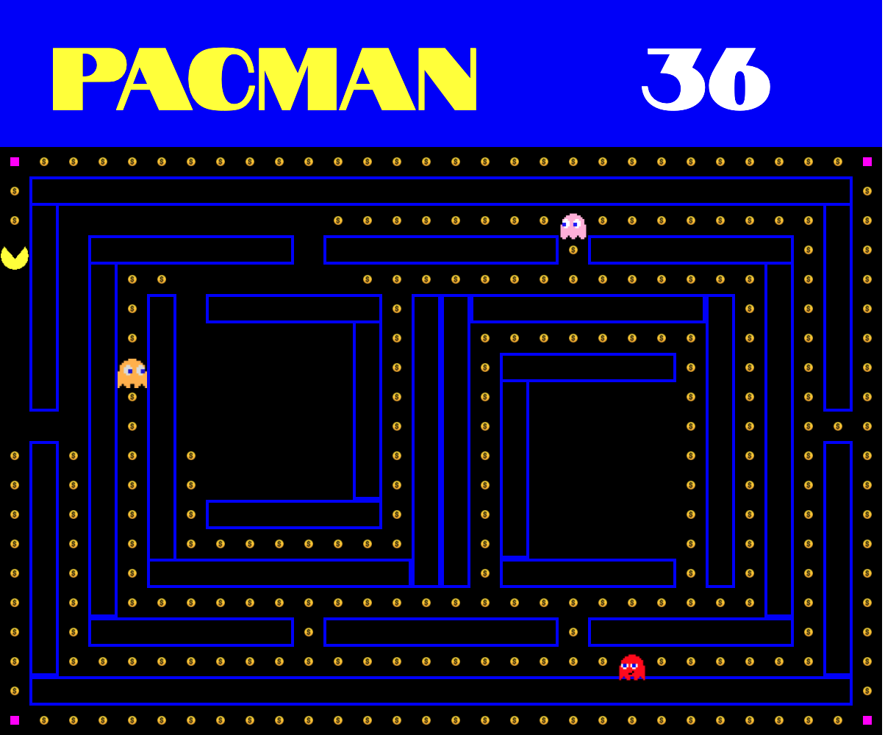
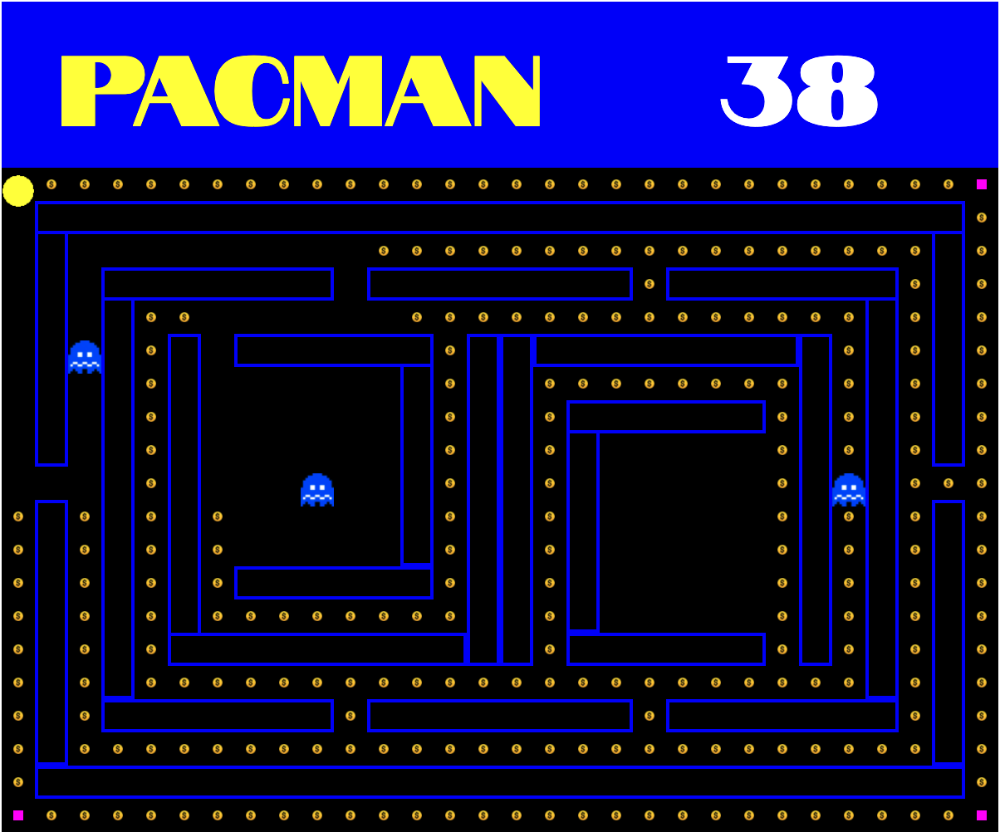
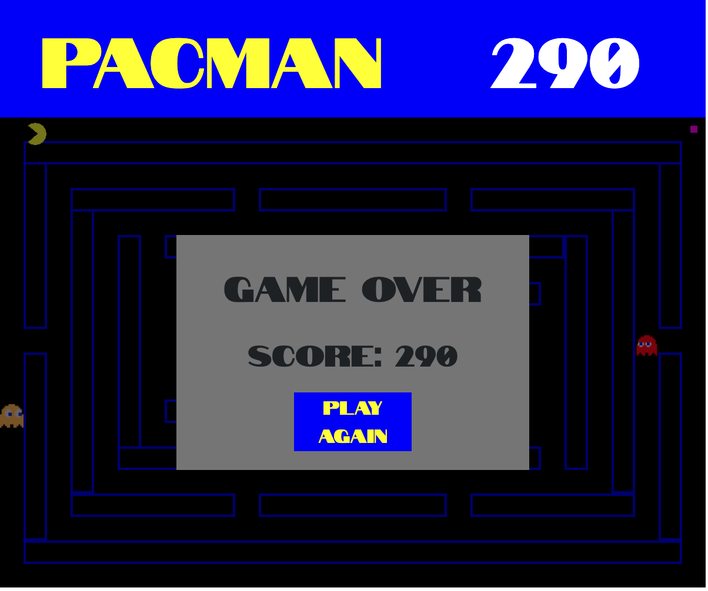

# PacMan-Clone

## Gameplay 🎮

Control Pacman with you WASD keys and collect all the treasures :gem: on the map without getting eaten by Pacman's enemies :ghost: . Be careful because Pacman's enemies are pretty smart! Some of them can track you down while others guard key choke points on the map!

## Flow 🌊

### Click to Start

### Use WASD to collect Coins!

### Use the PowerUps to defeat your enemies!

### Collect all the coins and win!

## Files overview 🗄️

1. main.js
2. objects.js
   - includes all objects and gameplay logic
3. algorithm.js
   - includes pathfinder algorithm
4. utils.js
   - includes miscellaneous functions
5. index.html
6. styles.css

## Challenges 💪

#### Enemy Movements 👻

Diving deeper into the Pacman and Enemy objects, both are children classes of the class "things", Pacman moves by identifying the keypress event and if there are walls ahead of him

The Enemy's movement is more complex. Initial implementation with Math.random function resulted in an enemy that on average remains around the same area, even with wall detection, the enemy does not progress far past its own start point.

Thus, a path finding algorithm was implemented to allow the enemy to move in the direction of pacMan while avoiding obstacles. The algorithm was initially planned to serve dynamic sourcenode and destination node positioning however, no solution could be found to recalculate the shortest path of a dynamic sourceNode without re-running the algorithm.

Hence, the current solution only appends movements taken by Pacman onto the existing shortest path array to allow the enemy to follow pacman's footsteps after it completes the initial shortest path.

An inherent problem with using a path finding algorithm in a game with multiple enemies is that all enemies will be moving along the same path.

A solution for this was to use waypoints (doors in the maze) as checkpoints. Dijkstra's algo was used to calculate the path between waypoints and each time the enemy approached a waypoint, it randomly chooses a next waypoint to move towards.

## Next Steps: 👣

1. Create the last enemy (Clyde)
2. Multiple lives for PacMan
3. Continuous and Smooth movements of Pacman and Enemies
